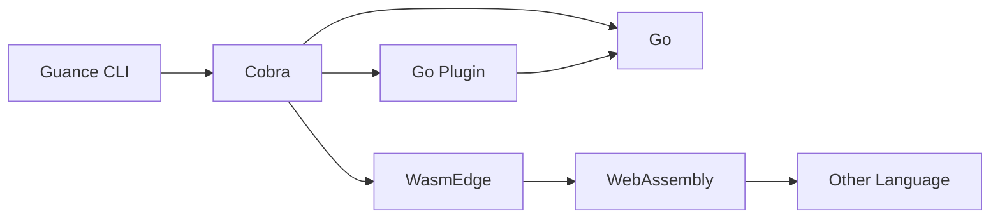
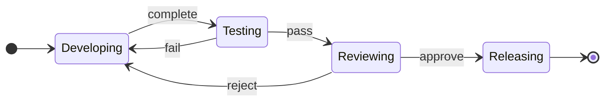

# A001: Guance CLI Overview

- Author(s): @yufeiminds
- Approver: @yufeiminds
- Status: Implemented
- Last updated: 2023-05-12
- Discussion at: GitHub issues (comma separated, filled after thread exists)

## Abstract

The position of Guance CLI in the Guance Cloud ecosystem is shown below:

- Yet another user interface for Guance Cloud
- Implementation of the imperative commands (describe in [Background](#background))
- Provider ecosystem integration solutions (describe in the [Proposal](#proposal))

This proposal will describe the engineering architecture design of Guance CLI.

## Background

CLI is an important developer tool for SaaS vendors. It is instead of the GUI as yet another interface for user interaction.

When using Cloud in the real world, there are three ways to interact with it:

- **Imperative** APIs and tools use action words to explain how to operate a specific resource. Examples of imperative APIs include RESTFul and Action.
- **Declarative** APIs and tools only describe the resource that is needed. The specific actions are automatically carried out by the platform or tool. For instance, Kubernetes Operator and Terraform compare the current resource state with the expected state to make decisions and execute orchestration logic.
- **Interactive** tools are designed to move users step by step toward their goals. The API debugger allows users to keep adjusting parameters and initiating requests until they achieve the desired outcome.

Guance CLI is focused on **imperative** commands. It is a tool to help users interact with Guance Cloud.

## Proposal

### CLI Commands



The Guance CLI command has three categories:

1. The first category command is written by Go. It is built on top of [Cobra](https://github.com/spf13/cobra). Cobra is a library providing a simple interface to create powerful modern CLI interfaces similar to git & go tools. Many excellent tools are built on top of Cobra, such as Kubectl, etc.
2. The second category command is written by Go. It is built on [Go Plugin](https://github.com/hashicorp/go-plugin) and compiles as a self-governed binary. It exposes the gRPC protocol to Guance CLI, and the CLI core can call the Go Plugin to complete the command.
3. The third category command is written by Other Language and compiled as a WebAssembly file. [WasmEdge](https://github.com/WasmEdge/WasmEdge) executes the WebAssembly file.

Guance CLI supports the 1 and 3 to develop the command. 1 to provide official features and 3 to provide community features. Every way has its advantages and disadvantages. The developer can choose the best way to develop the command.

### Configuration Convention

In Guance Cloud, We have a configuration convention for all the developer tools. In this convention:

1. All developer tools must accept the well-known environment variables.
   - `GUANCE_ACCESS_TOKEN`: The access token of Guance Cloud. It can be generated at [Guance Cloud Console](https://console.guance.com).
   - `GUANCE_REGION`: The region of Guance Cloud.
2. All developer tools must accept the well-known configuration file.
   - `~/.guance/config.yaml`: The configuration file of Guance Cloud. It can be generated by the `guance auth login` command.

Guance CLI will use [Viper](https://github.com/spf13/viper) to parse the configuration convention to provide the best user experience.

### Proposal Governance

The Guance CLI proposal governance solution is based on the Guance Community.

All the details can be found in [Guance Community Proposal Governance](https://github.com/GuanceCloud/community/tree/main/proposals) documentation.

### Testing Framework

User Specification is a document to describe the usage of Guance CLI. The specification format is based on the [ThoughtWorks Gauge](https://gauge.org/) project. Anyone can see the syntax of specifications in [Writing specifications](https://docs.gauge.org/writing-specifications.html).

We implement the testing framework to fit the CLI testing workflow based on Gauge. So the developer can use neutral language to describe the CLI usage, and the testing framework will execute the CLI commands and verify the results.

A simple example is shown below:

```markdown
# How to verify the installation

## Show version

- Run `guance version`
```

After the run, the testing framework will execute the command, and the result will be verified.

### Artifact Releasing

The Guance CLI is a developer tool. So we need to release the artifact to the developer. The artifact release is based on [GoReleaser](https://goreleaser.com/). GoReleaser is a release automation tool for Go projects. The goal is to simplify the build, release, and publish steps while providing variant customization options.

There are some targets that Guance CLI will release:

1. The Guance CLI binary file on GitHub release.
1. The Guance CLI package file on the GitHub release includes `DEB`, `RPM`, and `APK` packages.
1. The Guance CLI Remote Repository for Linux includes `APT` and `YUM` repo.
1. The Guance CLI Homebrew Tap for MacOS.
1. The Guance CLI Docker image on Docker Hub.

### Development Lifecycle

In this proposal, the development lifecycle is also an important thing to consider.



Guance CLI based on the [Mage](https://magefile.org/) to manage the automation scripts of SDLC (Software Development Life Cycle). Mage is a Make-like build tool using Go. You write plain-old go functions, and Mage automatically uses them as Makefile-like runnable targets.

The pros of using pure-Go to implement the automation scripts are: The automation scripts will have better readability, testability, and maintainability. We can use the Go testing framework to test the automation scripts and reuse the Go code and package to implement the automation scripts.

In the developing stage, the developer can use the `DevContainer` to develop the Guance CLI without any other dependencies. The `DevContainer` is based on [VSCode Remote Container](https://code.visualstudio.com/docs/remote/containers). It is a Docker container that has all the dependencies of Guance CLI. The developer can use the VSCode to develop the Guance CLI in the container.

In the testing stage, the developer can use the `./hack/make -v test` command to run the unit test and integration test. The unit test is based on the Go testing framework. The integration test is based on the Gauge testing framework.

In the reviewing stage, the developer can run the `./hack/make -v fmt` and `./hack/make -v lint` commands before the code review. It is based on the [GoFmt](https://golang.org/cmd/gofmt/) and [GolangCI-Lint](https://golangci-lint.run/).

In releasing stage, the developer can create a tag, and GitHub Actions will automatically invoke the GoReleaser. It will release all the artifacts to the GitHub release page and related repositories.

## Implementation

The implementation order is as follows:

1. Implement CLI Commands by Cobra
1. Implement Artifact Releasing by GoReleaser
1. Implement Development Lifecycle by Mage, DevContainer, and GitHub Actions
1. Implement Proposal Governance at Guance Community
1. Implement Testing Framework by Gauge
1. Implement Configuration Convention by Viper
