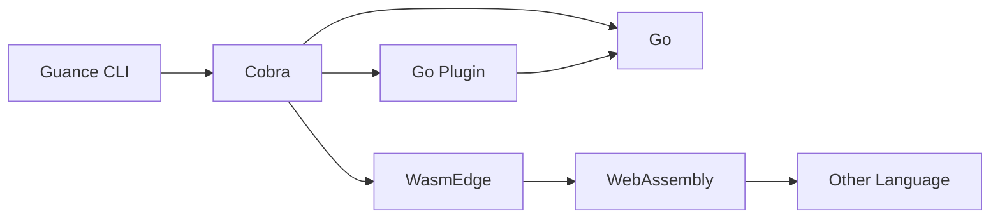
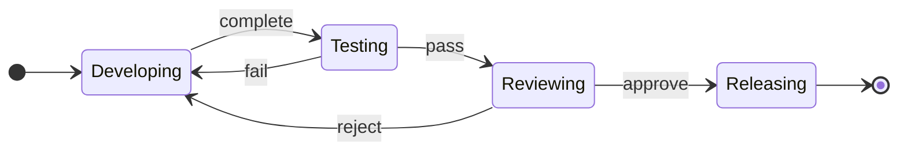

A001: Guance CLI Overview
----
* Author(s): yufeiminds
* Approver: yufeiminds
* Status: Implemented
* Last updated: 2023-05-12
* Discussion at: GitHub issues (comma separated, filled after thread exists)

## Abstract

The position of Guance CLI in the Guance Cloud ecosystem is shown below:

- Yet another user interface for Guance Cloud
- Implementation the imperative commands (describe at [Background](#background))
- Provider ecosystem integration solutions (describe at [Proposal](#proposal))

This proposal will describe the engineering architecture design of Guance CLI.

## Background

CLI is an important developer tool for SaaS Vendor. It is instead of the GUI as yet another interface for user's interaction.

In real-world usages, there are three way to interact with Cloud:

1. **Imperative** APIs and tools **use verbs to describe how to operate a specific resource**, such as creating a virtual machine instance, turning it on, and shutting it down. Popular API architecture styles such as RESTFul and Action are instances of imperative APIs.
2. **Declarative** APIs and tools **only need to describe what the expected resource looks like**. The specific actions to be performed are automatically completed by the tool or platform. For example, Kubernetes Operator, Terraform, etc., the tool itself often needs to compare the difference between the current actual resource state and the expected state, so tools can automatically make decisions and execute a series of orchestration logic.
3. **Interactive** tools **based on a series of interactive design**, step by step **close to the user's goal**. For example: API debugger can allow users to continuously modify parameters and initiate requests until they get the results they want.

Guance CLI is focuses on the **imperative** commands. It is a tool to help users interact with Guance Cloud.

## Proposal

### CLI Commands



The Guance CLI command has three categories:

1. The first category command is written by Go. It is built on top of [Cobra](https://github.com/spf13/cobra). Cobra is a library providing a simple interface to create powerful modern CLI interfaces similar to git & go tools. Many awesome tools is built on top of Cobra, such as Kubectl, and etc.
2. The second category command is written by Go. It is built on top of [Go Plugin](https://github.com/hashicorp/go-plugin) and compile as a self-governed binary. It exposes the gRPC protocol to Guance CLI, and CLI core can call the Go Plugin to complete the command.
3. The third category command is written by Other Langugae and compile as a WebAssembly file. The WebAssembly file is executed by [WasmEdge](https://github.com/WasmEdge/WasmEdge).

Guance CLI supports the 1 and 3 to develop the command. The 1 to provide official features and 3 to provide community features. Every way has its own advantages and disadvantages. The developer can choose the best way to develop the command.

### Configuration Convention

In Guance Cloud, We has a configuration convention for all the developer tools. In this convention:

1. All developer tools must accept the well-known environment variables.
    * `GUANCE_ACCESS_TOKEN`: The access token of Guance Cloud. It can be generated at [Guance Cloud Console](https://console.guance.com).
    * `GUANCE_REGION`: The region of Guance Cloud.
2. All developer tools must accept the well-known configuration file.
    * `~/.guance/config.yaml`: The configuration file of Guance Cloud. It can be generated by `guance auth login` command.

Guance CLI will use [viper](https://github.com/spf13/viper) parse the configuration convention to provide the best user experience.

### Proposal Governance

The Guance CLI proposal governance solution is based on the Guance Community.

All the details can found at [Guance Community Proposal Governance](https://github.com/GuanceCloud/community/tree/main/proposals) documentation.

### Testing Framework

User Specification is a document to describe the usage of Guance CLI. The format of specification is based on [ThoughtWorks Gauge](https://gauge.org/) project. Anyone can see the syntax of specification in [Writing specifications](https://docs.gauge.org/writing-specifications.html).

We implement the testing framework to fit the CLI testing workflow based on Gauge. So the developer can use neutral language to describe the CLI usage and the testing framework will execute the CLI commands and verify the results.

A simple example is shown below:

```markdown
# How to verify the installation

## Show version

* Run `guance version`
```

The command after `run` will be executed by the testing framework and the result will be verified.

### Artifact Releasing

The Guance CLI is a developer tool. So we need to release the artifact to the developer. The artifact releasing is based on [GoReleaser](https://goreleaser.com/). GoReleaser is a release automation tool for Go projects, the goal is to simplify the build, release and publish steps while providing variant customization options for all steps.

There are some target that Guance CLI will release:

1. The Guance CLI binary file on GitHub release.
1. The Guance CLI package file on GitHub release, includes `DEB`, `RPM`, `APK` package.
1. The Guance CLI Remote Repository for Linux, includes `APT` and `YUM` repo.
1. The Guance CLI Homebrew Tap for MacOS.
1. The Guance CLI Docker image on Docker Hub.

### Development Lifecycle

In this proposal, the development lifecycle is also an important thing to consider.



Guance CLI based on the [Mage](https://magefile.org/) to manage the automation scripts of SDLC (Software Development Life Cycle). Mage is a Make-like build tool using Go. You write plain-old go functions, and Mage automatically uses them as Makefile-like runnable targets.

The pros of use pure-Go to implement the automation scripts is: The automation scripts will have a better readability, testability and maintainability. We can use the Go testing framework to test the automation scripts, and reuse the Go code and package to implement the automation scripts.

In developing stage, the developer can use the `DevContainer` to develop the Guance CLI without any other dependencies. The `DevContainer` is based on [VSCode Remote Container](https://code.visualstudio.com/docs/remote/containers). It is a Docker container that has all the dependencies of Guance CLI. The developer can use the VSCode to develop the Guance CLI in the container.

In testing stage, the developer can use the `./hack/make -v test` command to run the unit test and integration test. The unit test is based on the Go testing framework. The integration test is based on the Gauge testing framework.

In reviewing stage, the developer can use the `./hack/make -v fmt` and `./hack/make -v lint` command to run before the code review. It is based on the [GoFmt](https://golang.org/cmd/gofmt/) and [GolangCI-Lint](https://golangci-lint.run/).

In releasing stage, the developer can create a tag and the GoReleaser will be invoked by GitHub Actions automatically. It will release all the artifacts to the GitHub release page and related repositories.

## Implementation

The implement order is:

1. Implement CLI Commands by Cobra
1. Implement Artifact Releasing by GoReleaser
1. Implement Development Lifecycle by Mage, DevContainer, and GitHub Actions
1. Implement Proposal Governance at Guance Community
1. Implement Testing Framework by Gauge
1. Implement Configuration Convention by Viper
